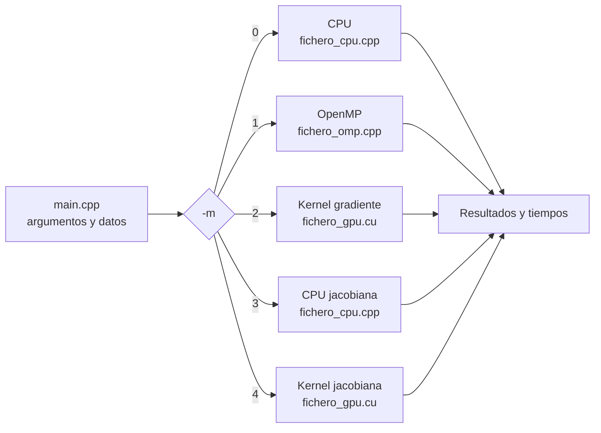

<div align="center">

# Parallel Gradients · CPU · OpenMP · CUDA

**Cálculo de gradientes y matrices jacobianas por diferencias finitas en CPU, OpenMP y CUDA, con validación numérica cruzada y benchmarks de rendimiento.**

[](https://github.com/gguillex/parallel-gradients-cuda-openmp/actions/workflows/ci.yml)
[](LICENSE)


</div>

---

El mismo problema numérico implementado con tres modelos de ejecución, para medir de forma rigurosa qué aporta cada nivel de paralelismo y en qué tipo de carga compensa:

| Backend | Modelo | Papel en el proyecto |
|---|---|---|
| **CPU secuencial** | Un núcleo, bucle clásico | Referencia para validar los resultados |
| **OpenMP** | Memoria compartida, todos los núcleos | Paralelismo multinúcleo y estudio de anidamiento |
| **CUDA** | Un hilo de GPU por variable o por punto | Paralelismo masivo y ajuste del tamaño de bloque |

> **Resultado principal:** en una NVIDIA T4, el kernel CUDA calcula un millón de derivadas en **9,2 ms**, frente a los **3,46 s** de la mejor configuración OpenMP: **≈ 376× más rápido**.

## Índice

- [Características](#características)
- [Problemas resueltos](#problemas-resueltos)
- [Inicio rápido](#inicio-rápido)
- [Uso](#uso)
- [Arquitectura](#arquitectura)
- [Resultados](#resultados)
- [Reproducir en Google Colab](#reproducir-en-google-colab)
- [Estructura del repositorio](#estructura-del-repositorio)
- [Conclusiones](#conclusiones)
- [Limitaciones y trabajo futuro](#limitaciones-y-trabajo-futuro)
- [Licencia](#licencia)

## Características

- **Tres backends intercambiables** desde la línea de comandos, sin recompilar.
- **Dos escenarios con perfiles opuestos:** uno limitado por cálculo (*compute-bound*) y otro limitado por memoria (*memory-bound*).
- **Validación automática** entre backends y frente a la derivada analítica (error < 1 %).
- **Temporización desglosada en GPU** con `cudaEvent`: copia de ida, kernel y copia de vuelta.
- **Comprobación de errores CUDA** en reservas, copias, eventos y lanzamientos de kernel.
- **Estudios de rendimiento:** escalabilidad fuerte y débil, coste del paralelismo anidado y ajuste del tamaño de bloque.
- **Batería de pruebas reproducible** (`benchmark.sh`) e **integración continua** con GitHub Actions sobre CUDA 11.8 y 12.4.

## Problemas resueltos

### A. Gradiente de alta carga aritmética (*compute-bound*)

`N` variables independientes (hasta millones), cada una con una evaluación trigonométrica de `T` términos:

$$
f(x) = x + \sum_{k=1}^{T} \sin(kx)\,\cos(kx)
$$

La derivada se aproxima con una **diferencia central** (`h = 1e-4`):

$$
f'(x) \approx \frac{f(x+h) - f(x-h)}{2h}
$$

Casi no hay acceso a memoria y casi todo es cálculo, así que este escenario mide la capacidad aritmética del hardware.

### B. Jacobiana de un sistema no lineal (*memory-bound*)

Para cada punto `(x, y, z)` se calcula la **matriz jacobiana 3×3** del sistema:

$$
\begin{aligned}
f_1(x,y,z) &= 3x^2 + yz + z + 3 \\
f_2(x,y,z) &= 4x + yz^3 + 2 \\
f_3(x,y,z) &= y - 3xz + 8yz + z^2 - 3
\end{aligned}
$$

El cálculo por punto es barato, pero se repite sobre cientos de miles de puntos (3 `float` leídos y 9 escritos por punto), así que el factor limitante es el movimiento de datos.

## Inicio rápido

### Requisitos

| Componente | Versión | Necesario para |
|---|---|---|
| Linux + `g++` con OpenMP | GCC ≥ 9 | Todo |
| `make` | — | Compilación |
| CUDA Toolkit (`nvcc`) | ≥ 11.0 | Backend CUDA |
| GPU NVIDIA | Compute capability ≥ 6.0 | Ejecutar los modos CUDA |

> ¿No tienes GPU NVIDIA? Puedes ejecutarlo gratis en [Google Colab](#reproducir-en-google-colab). La variante [`openmp/`](openmp) compila en cualquier Linux sin CUDA.

### Compilar y ejecutar

```bash
git clone https://github.com/gguillex/parallel-gradients-cuda-openmp.git
cd parallel-gradients-cuda-openmp/cuda

make                                        # genera ./gradientes
./gradientes -m 2 -v 1000000 -terms 200     # 1M derivadas en GPU
make benchmark                              # batería completa de pruebas
```

### Arquitectura de la GPU

Por defecto se compila para `sm_75`. Para otra GPU, indica su *compute capability*:

| GPU | Comando |
|---|---|
| GTX 10xx (Pascal) | `make CUDA_ARCH=61` |
| RTX 20xx · T4 (Turing) | `make` |
| A100 (Ampere) | `make CUDA_ARCH=80` |
| RTX 30xx (Ampere) | `make CUDA_ARCH=86` |
| RTX 40xx (Ada Lovelace) | `make CUDA_ARCH=89` |

Si CUDA no está en `/usr/local/cuda`: `make CUDA_PATH=/ruta/a/cuda`.

## Uso

```text
./gradientes -m <modo> [-v N] [-terms T] [-t hilos] [-n 0|1]
```

| Opción | Descripción | Por defecto |
|---|---|---|
| `-m` | Modo de ejecución (ver la tabla siguiente) | `0` |
| `-v` | Variables (modos 0–2) o puntos (modos 3–4) | `1000` |
| `-terms`, `-l` | Términos trigonométricos por evaluación (escenario A) | `1000` |
| `-t` | Hilos OpenMP, o hilos por bloque en CUDA (1–1024) | todos los núcleos / `256` |
| `-n` | `1` activa el paralelismo anidado en OpenMP | `0` |

| Modo | Escenario | Backend |
|:---:|---|---|
| `0` | A · gradiente | CPU secuencial |
| `1` | A · gradiente | OpenMP |
| `2` | A · gradiente | CUDA |
| `3` | B · jacobiana | CPU secuencial |
| `4` | B · jacobiana | CUDA |

### Ejemplos

```bash
./gradientes -m 0 -v 1000000 -terms 200              # referencia secuencial
./gradientes -m 1 -v 1000000 -terms 200 -t 8         # OpenMP, 8 hilos
./gradientes -m 1 -v 1000000 -terms 50 -t 4 -n 1     # OpenMP anidado (estudio de sobrecarga)
./gradientes -m 2 -v 1000000 -terms 200 -t 128       # CUDA, bloques de 128 hilos
./gradientes -m 4 -v 100000                          # 100 000 jacobianas en GPU
```

### Ejemplo de salida

```text
=== GRADIENTES EN PARALELO ===
Modo: 3 | Hilos: 16 | Nested: 0
>> SISTEMA: Jacobiana 3x3 (3 Puntos)
   [Info] Sistema de ecuaciones:
   -> f1(x,y,z) = 3x^2 + yz + z + 3
   -> f2(x,y,z) = 4x + yz^3 + 2
   -> f3(x,y,z) = y - 3xz + 8yz + z^2 - 3
   --------------------------------------
Tiempo Host: 0.0000 s

--- RESULTADOS (Muestra de los 5 primeros) ---
Punto 0 (Jacobiana 3x3 aplanada):
[ 2.68 0.90 1.43 ]
[ 4.00 0.72 1.04 ]
[ -2.69 8.16 3.92 ]
```

En los modos CUDA se añade el desglose de tiempos de la GPU:

```text
   === CUDA SUMMARY (Modo 2) ===
   [H2D]:    ... ms     copia host → GPU
   [Kernel]: ... ms     cálculo
   [D2H]:    ... ms     copia GPU → host
   [TOTAL]:  ... ms
```

## Arquitectura



### OpenMP

- `#pragma omp parallel for` sobre las variables con `schedule(static)`. Todas las iteraciones cuestan lo mismo, así que un reparto fijo minimiza la sobrecarga.
- No hay dependencias entre iteraciones: cada hilo escribe en una posición distinta del vector de salida, sin *locks* ni reducciones.
- Con `-n 1` se abre, en cada iteración, una región paralela interna (`parallel sections`) que evalúa `f(x−h)` y `f(x+h)` a la vez. Sirve para cuantificar el coste de paralelizar con un grano demasiado fino.

### CUDA

- **Un hilo por variable** (escenario A) o **por punto** (escenario B), en una rejilla 1D de `⌈N / bloque⌉` bloques.
- Fases medidas por separado con `cudaEvent`: H2D, kernel y D2H.
- `CUDA_CHECK` en reservas, copias y eventos, y `cudaGetLastError` tras cada lanzamiento.
- En el escenario B la diferencia central (`h = 1e-3`) da la jacobiana prácticamente exacta, porque las funciones son polinomios de grado bajo.

## Resultados

Hay dos conjuntos de mediciones:

- **Google Colab (NVIDIA T4):** la salida de `benchmark.sh` sin retocar, reproducible por cualquiera ([instrucciones](#reproducir-en-google-colab)).
- **Equipo local (CPU de 8 hilos):** medias de 5 ejecuciones con mayor carga (1000 términos).

### Validación numérica (primer gradiente, `x₀`)

| Backend | 100 términos (T4) | 1000 términos (local) |
|---|---:|---:|
| Derivada analítica | 114.4500 | 752.79 |
| CPU secuencial | 114.4379 | 747.66 |
| OpenMP | 114.4379 | 747.66 |
| CUDA | 114.4344 | — |

CPU y OpenMP coinciden bit a bit. La GPU difiere en menos de un 0,01 %, porque sus `sin`/`cos` de precisión simple redondean de forma ligeramente distinta. El error frente a la derivada exacta es siempre menor del **1 %**, y la jacobiana de CPU y la de CUDA son idénticas.

### Google Colab · NVIDIA T4

`N = 1 000 000` variables, 200 términos.

| Prueba | Tiempo | Comparación |
|---|---:|---|
| CPU, 1 hilo | 5,23 s | referencia |
| OpenMP, 4 hilos | 3,48 s | 1,5× ¹ |
| OpenMP, 8 hilos | 3,46 s | 1,5× ¹ |
| **CUDA, bloque 256** | **9,20 ms** | **≈ 376×** sobre OpenMP · **≈ 569×** sobre 1 hilo |
| CUDA, bloque 32 | 9,62 ms | +4,5 % frente a bloque 256 |
| OpenMP sin anidar (50 términos, 4 hilos) | 0,81 s | — |
| OpenMP anidado (50 términos, 4 hilos) | 90,7 s | **112× más lento** |
| Jacobiana, 100 000 puntos (CUDA) | 3,47 ms | H2D + kernel + D2H |

¹ Las máquinas de Colab tienen muy pocos núcleos de CPU, así que OpenMP deja de escalar enseguida. Con más núcleos, la ganancia es mucho mayor (ver la tabla siguiente).

### Equipo local · CPU de 8 hilos

`N = 1 000 000` variables.

| Estudio | Configuración | Resultado |
|---|---|---|
| Escalabilidad fuerte | 1000 términos, de 1 a 8 hilos | De más de 40 s a **5,21 s**. Con tanta carga por iteración, la gestión de hilos es despreciable |
| Escalabilidad débil | 4 hilos, de 100K a 5M variables | El tiempo crece linealmente con el tamaño: O(N) sin cuellos de botella |
| Paralelismo anidado | 50 términos, 4 hilos | De menos de 1 s a más de 70 s |
| Tamaño de bloque CUDA | 32 · 128 · 256 hilos | 32 es un 8 % más lento; 128 y 256 son casi iguales |
| **CPU vs GPU** | OpenMP 8 hilos vs CUDA bloque 256 | 5,21 s → 17,1 ms: **≈ 300×** |

## Reproducir en Google Colab

Colab ofrece gratis una **NVIDIA T4**, que es la arquitectura que el `Makefile` usa por defecto:

1. Crea un cuaderno en [colab.research.google.com](https://colab.research.google.com).
2. En el menú, elige *Entorno de ejecución → Cambiar tipo de entorno → GPU T4*.
3. Ejecuta en una celda:

```bash
!git clone https://github.com/gguillex/parallel-gradients-cuda-openmp.git
%cd parallel-gradients-cuda-openmp/cuda
!make && ./benchmark.sh
```

## Estructura del repositorio

```text
.
├── cuda/                       Versión principal: CPU + OpenMP + CUDA
│   ├── main.cpp                Argumentos, generación de datos y salida
│   ├── fichero_cpu.cpp/.h      Backend secuencial (escenarios A y B)
│   ├── fichero_omp.cpp/.h      Backend OpenMP (con estudio de anidamiento)
│   ├── fichero_gpu.cu/.h       Kernels CUDA y temporización con cudaEvent
│   ├── wtime.cpp/.h            Temporizador de pared
│   ├── definitions.h           Tipos de datos (type_data = float)
│   ├── benchmark.sh            Batería de pruebas y validación
│   └── Makefile
├── openmp/                     Variante solo CPU, sin dependencia de CUDA
│   ├── main.cpp
│   ├── fichero_cpu.cpp/.h
│   ├── fichero_omp.cpp/.h
│   ├── wtime.cpp/.h · type.h · definitions.h
│   └── Makefile
├── .github/workflows/ci.yml    Integración continua
├── LICENSE
└── README.md
```

### Variante `openmp/`

Calcula el gradiente de una función polinómica acoplada sobre muchos puntos a la vez:

$$
f(\mathbf{x}) = 5 + \sum_{i} 2x_i + \sum_{i} 3x_i x_{i+1}
$$

Aquí hay dos niveles de paralelismo naturales, entre puntos y entre variables, lo que la hace adecuada para estudiar el paralelismo anidado. Acumula en `double` y evalúa la perturbación sin modificar el array de entrada, así que es segura con hilos anidados.

```bash
cd openmp
make
./gradientes_omp -m 1 -s 100000 -v 10 -t 8     # -s puntos · -v variables · -n 1 anidado
```

## Conclusiones

1. **El hardware se elige según el problema.** Con cálculo intensivo, la GPU gana por varios órdenes de magnitud. Con poco cálculo y muchos datos sigue ganando, pero el margen se reduce porque lo que limita es la transferencia.
2. **Paralelizar no siempre acelera.** Con un grano demasiado fino, como en el caso anidado, el programa puede ir más de 100 veces más lento.
3. **El tamaño de bloque importa.** Con bloques muy pequeños la GPU queda infrautilizada; a partir de 128–256 hilos el rendimiento se estabiliza.
4. **Validar antes de medir.** La versión secuencial es la referencia; sin ella, un *speedup* no garantiza nada.

## Limitaciones y trabajo futuro

- Los cálculos van en `float` para aprovechar al máximo la GPU, así que el gradiente es una aproximación (error < 1 % con 1000 términos).
- El tiempo de CUDA no incluye `cudaMalloc` ni la creación del contexto.
- Posibles líneas de trabajo:
  - [ ] Intrínsecos rápidos (`__sinf`, `sincosf`) y su efecto en velocidad y precisión.
  - [ ] Solapar transferencias y cálculo con *CUDA streams*.
  - [ ] Versión en `double` para comparar el rendimiento FP32 frente a FP64.
  - [ ] Generación automática de gráficas desde `benchmark.sh`.

## Licencia

Distribuido bajo la licencia MIT. Consulta [`LICENSE`](LICENSE) para más información.

---

<div align="center">

Desarrollado por **Guillermo García Andugar** · [@gguillex](https://github.com/gguillex)

</div>
